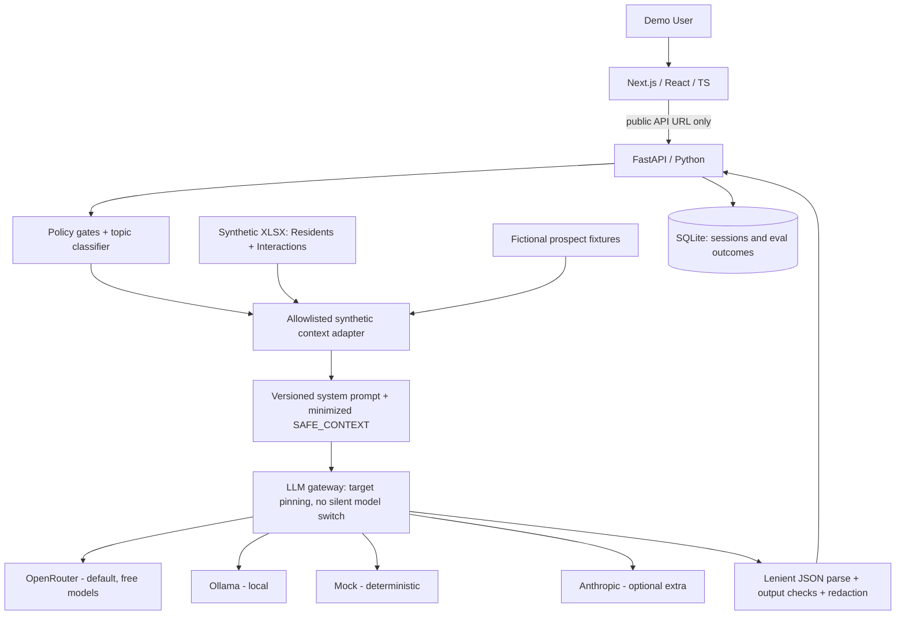

# Architecture v1 diagram (historical)

Archived from the original `docs/ARCHITECTURE.md` (sprint 1). Superseded by [../diagrams/system-architecture.md](../diagrams/system-architecture.md).

```mermaid
flowchart TD
  U[Demo User] --> FE[Next.js / React / TS]
  FE -->|public API URL only| API[FastAPI / Python]
  API --> ROUTE[Policy gates + topic classifier]
  ROUTE --> DATA[Allowlisted synthetic context adapter]
  XLSX[Synthetic XLSX: Residents + Interactions] --> DATA
  PROS[Fictional prospect fixtures] --> DATA
  DATA --> PROMPT[Versioned system prompt + minimized SAFE_CONTEXT]
  PROMPT --> GW[LLM gateway: target pinning, no silent model switch]
  GW --> OR[OpenRouter - default, free models]
  GW --> OL[Ollama - local]
  GW --> MK[Mock - deterministic]
  GW --> AN[Anthropic - optional extra]
  GW --> POST[Lenient JSON parse + output checks + redaction]
  POST --> API
  API --> DB[(SQLite: sessions and eval outcomes)]
```

